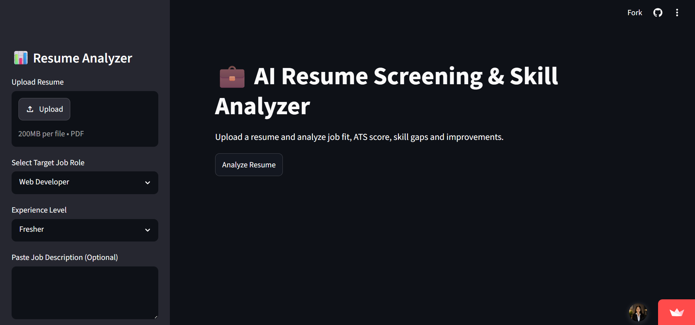
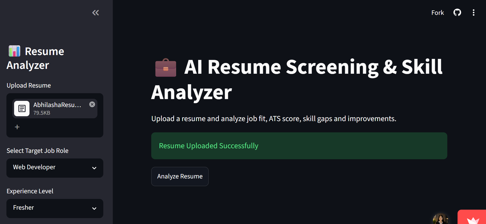
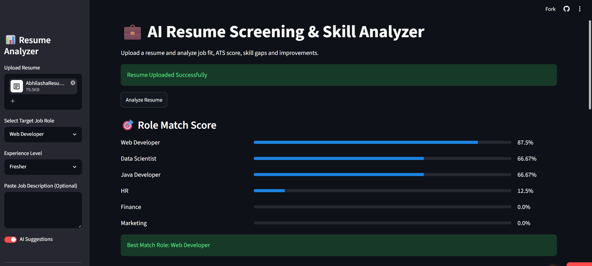
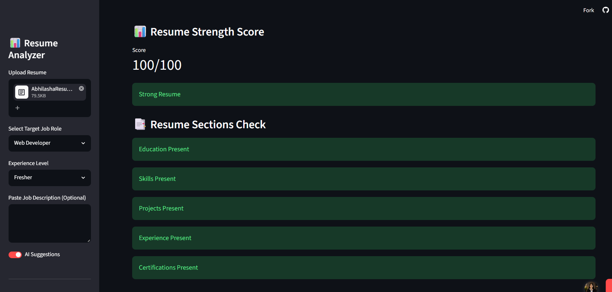
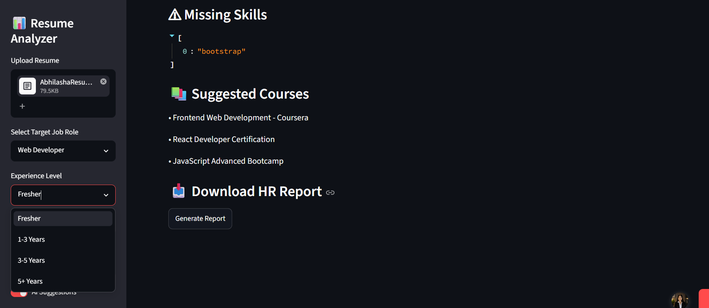

# 📊 AI Resume Screening & Skill Analyzer

An AI-powered Resume Analyzer web application that analyzes resumes using ATS standards, role matching, resume strength evaluation, and skill gap analysis.

The system helps candidates improve resumes and increase job selection chances through AI-driven recommendations.

---

# 🚀 Features

✅ Upload Resume PDF  
✅ ATS Resume Analysis  
✅ Resume Strength Score  
✅ Role Match Prediction  
✅ Missing Skills Detection  
✅ AI Suggestions  
✅ Suggested Courses  
✅ HR Report Generation  
✅ Experience-Level Filtering  

---

# 🛠️ Tech Stack

## Frontend
- HTML
- CSS
- JavaScript

## Backend
- Python
- Flask

## Machine Learning
- Scikit-learn
- NLP
- Resume Parsing

---

# 📂 Project Structure

```bash
RESUME-ANALYZER/
│
├── images/
│   ├── home.png
│   ├── upload.png
│   ├── role-match.png
│   ├── resume-strength.png
│   └── missing-skills.png
│
├── app.py
├── model.pkl
├── vectorizer.pkl
├── train_model.py
├── requirements.txt
└── README.md
```

---

# ▶️ Run the Project

## 1️⃣ Clone Repository

```bash
git clone <your-github-repo-link>
cd Resume-Analyzer
```

---

## 2️⃣ Install Dependencies

```bash
pip install -r requirements.txt
```

---

## 3️⃣ Run Application

```bash
python app.py
```

---

# 🌐 Open in Browser

```text
http://localhost:5000
```

---

# 📸 Screenshots

## 🏠 Home Page



---

## 📤 Resume Upload



---

## 🎯 Role Match Score



---

## 💪 Resume Strength Score



---

## ⚠️ Missing Skills & Suggested Courses



---

# 🎯 Supported Roles

- Web Developer
- Java Developer
- Data Scientist
- HR
- Finance
- Marketing

---

# 📄 How It Works

1. Upload Resume PDF
2. Select Job Role
3. Choose Experience Level
4. Analyze Resume
5. Get:
   - ATS Score
   - Resume Strength
   - Missing Skills
   - AI Suggestions
   - Suggested Courses

---

# 📈 Future Improvements

- LinkedIn Profile Analysis
- AI Resume Builder
- GPT-based Feedback
- Multi-language Support
- Job Recommendation System

---

# 🤝 Contributing

Contributions are welcome!

1. Fork the repository
2. Create your branch
3. Commit changes
4. Push changes
5. Open Pull Request

---

# 📜 License

This project is licensed under the MIT License.

---

# 👩‍💻 Author

## Abhilasha Sahu

💼 AI & Web Development Enthusiast

---

# ⭐ Support

If you like this project, give it a ⭐ on GitHub!
